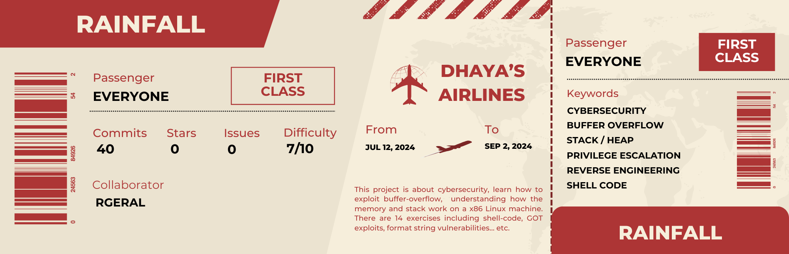

    

<h1 align="center">
    RainFall
</h1>

	<b><i>Cybersecurity project to learn more about buffer overflow.</i></b> 

Welcome to our Rainfall. For every exercice we wrote a very detailed explanations of how we found the solutions as well as some deep explanations on how memory works, or everything that can be usefull to understand buffer overflows used in Rainfall. The explanations are meant to be as clear as possible, you can find them in every README.md of every level of this project. You also can have more explanations if necessary in Resources/explanations.md of every level.

This project has been made with [rgeral](https://github.com/Rgeral)
